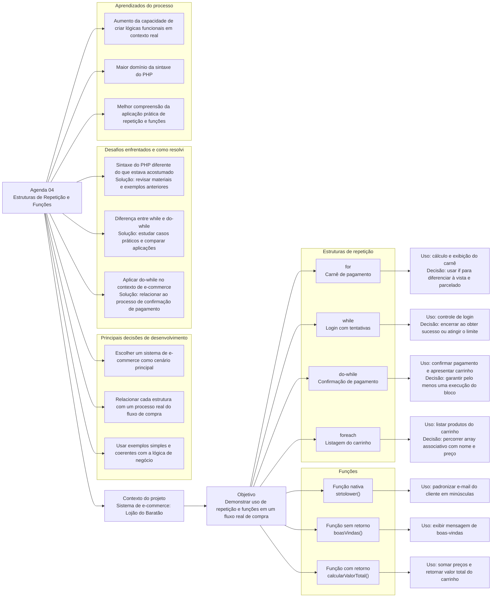

# Agenda 04 - Mapa Mental Digital



## Sistema de e-commerce: "Lojão do Baratão"

O projeto tem como objetivo desenvolver um exemplo de aplicação autoral que utiliza estruturas de repetição (`for`, `foreach`, `while`, `do-while`) e funções (funções nativas, funções sem retorno e funções com retorno). E posteriormente a apresentação das ideias, aprendizados e decisões organizadas em um mapa mental digital.

Com base nos estudos através da apostila e tutoria, o sistema escolhido foi um sistema de um e-commerce, contendo no mínimo um bloco de código para cada estrutura de repetição/tipo de função aprendidas. 

### `for`
Uma parte do código do sistema que imprime o carnê de pagamento após o cliente definir o número de parcelas: 

```php
$numParcelas = $_POST['numParcelas'];

if ($numParcelas > 1) {
    for ($parcela = 1; $parcela <= $numParcelas; $parcela++) {
        echo "Parcela $parcela de $numParcelas <br>";
    }
} else {
    echo "Pagamento à vista <br>";
}
```

### `while`
Uma parte do código do sistema que pede o login novamente caso as credenciais inseridas sejam invalidas:

```php
$tentativa = 0;
$maxTentativas = 3;

while ($tentativa < $maxTentativa) {
    $sucesso = loginAutorizado($usuarioCorreto, $senhaCorreta);

    if ($sucesso){
        break;
    }

    $tentativa++;
}

if ($tentativa == $maxTentativa) {
    echo "Usuário bloqueado, tente novamente mais tarde.";
}
```

### `do-while`
Uma parte do código do sistema que apresenta a tela com os dados do carrinho e valor total para então confirmar o método de pagamento: 

```php
do {
    $formaPagamento = selecaoFormaPagamento();  // Vamos supor que essa função apresenta as formas de pagamento e captura qual forma o cliente escolheu. 
    echo $carrinho . "<br>O Valor total da sua compra é de: $valorTotal <br> Forma de pagamento escolhida: $formaPagamento"; 
    $sucesso = processaPagamento($valorTotal, $formaPagamento); // Vamos supor que essa função tenta processar o pagamento conforme o valor e a forma de pagamento selecionada. 

} while ($sucesso == false);
```

### `foreach`
Uma parte do código do sistema imprime todo o carrinho de compras na tela:

```php
$carrinhoDeCompras = getCarrinhoArrayAssociativo(); // Vamos supor que essa função captura a lista associativa contendo os itens do carrinho de compra, no formato ["nome" => "Calculadora", "preco" => 11.5]

foreach ($carrinhoDeCompras as $produto) {
    echo "Produto: " . $produto["nome"] . " - Preço: " . $produto["preco"] . "<br>";
}
```
### Função Nativa
Uma parte do código do sistema que converte o e-mail enviado pelo cliente na tela de login em minúsculas: 

```php
$emailCliente = $_POST['emailCliente'];
$emailFormatado = strtolower($emailCliente);
```

### Função sem retorno

```php
function boasVindas($nome, $loja){
    echo "Olá $nome, seja bem-vindo(a) à $loja!";
}

boasVindas($nomeUsuario, $nomeLoja);
```

### Função com retorno

Uma parte do código do sistema que captura, calcula e retorna o valor total dos produtos do carrinho de compras:
```php
function calcularValorTotal($carrinhoDeCompras) {
    $valorTotal = 0;
    foreach ($carrindoDeCompras as $produto) {
        $valorTotal += $produto["preco"]; 
    }
    return $valorTotal;
}
```

## Reflexão Crítica

### Desafios de Desenvolvimento

1. Lembrar corretamenta da sintaxe do PHP, que embora parecida, é diferente do que já estava acostumado (Python). Superado ao consultar os materiais desta aula e de aulas anteriores sobre o tema.   
2. Entender de vez a diferença entre `while` e `do-while` e suas aplicações, são muito parecidos e quase tudo que é possível solucionar com um, também é possível solucionar com o outro. Superado ao pesquisar e estudar exemplos práticos da utilização de ambas as estruturas.
3. Imaginar o contexto da estrutura `do-while` dentro do escopo de um sistema de e-commerce. Superado com o estudo e pesquisa de exemplos práticos em sistemas reais. 

### Aprendizados do Processo

1. Aumento da habilidade em desenvolver lógicas de programação funcionais para um contexto diferente. 
2. Aumento do domínio da sintaxe do PHP através do desenvolvimento dos exemplos do código-fonte.